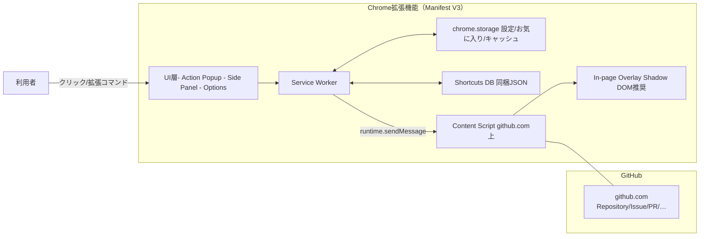
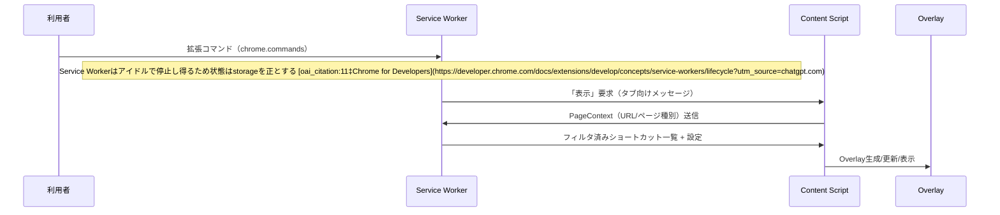

```mermaid

flowchart LR
  U[利用者] -->|クリック/拡張コマンド| UI

  subgraph EXT[Chrome拡張機能（Manifest V3）]
    UI[UI層- Action Popup - Side Panel - Options] --> SW[Service Worker]
    SW <--> ST[chrome.storage 設定/お気に入り/キャッシュ]
    SW <--> DB[Shortcuts DB 同梱JSON ]
    SW -->|runtime.sendMessage| CS[Content Script github.com上 ]
    CS --> OV[In-page Overlay Shadow DOM推奨]
  end

  subgraph WEB[GitHub]
    GH[github.com\n Repository/Issue/PR/…]
  end

  CS --- GH
```
- オーバーレイ描画は Content Script が担当する。ページ DOM と衝突しにくくするため、Shadow DOM を採用する方針が妥当である（設計判断）。
- chrome.storage は、拡張固有の永続データを保持するための API である。

```mermaid
sequenceDiagram
  participant User as 利用者
  participant SW as Service Worker
  participant CS as Content Script
  participant OV as Overlay

  User->>SW: 拡張コマンド（chrome.commands）
  Note over SW: Service Workerはアイドルで停止し得るため状態はstorageを正とする [oai_citation:11‡Chrome for Developers](https://developer.chrome.com/docs/extensions/develop/concepts/service-workers/lifecycle?utm_source=chatgpt.com)
  SW->>CS: 「表示」要求（タブ向けメッセージ）
  CS->>SW: PageContext（URL/ページ種別）送信
  SW->>CS: フィルタ済みショートカット一覧 + 設定
  CS->>OV: Overlay生成/更新/表示
```